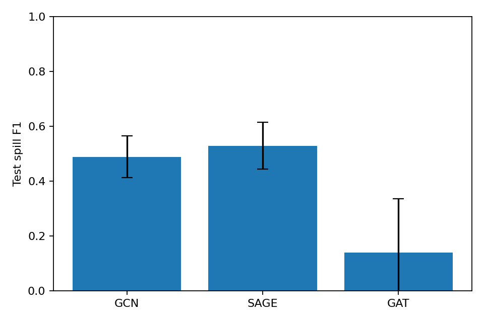
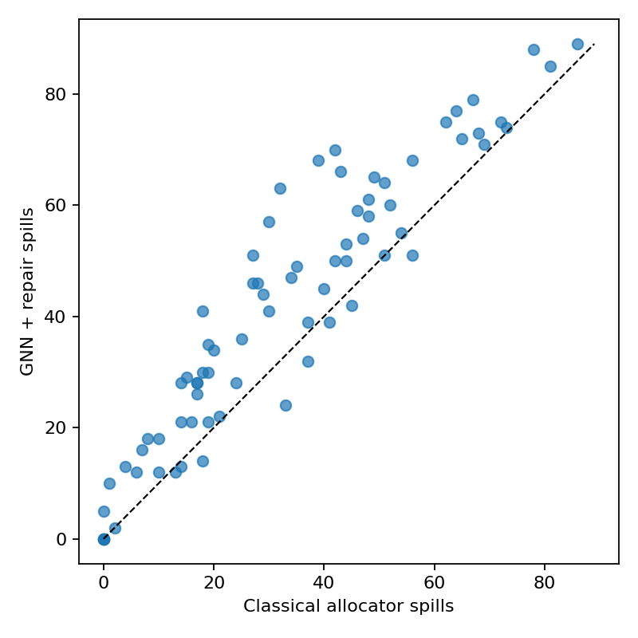
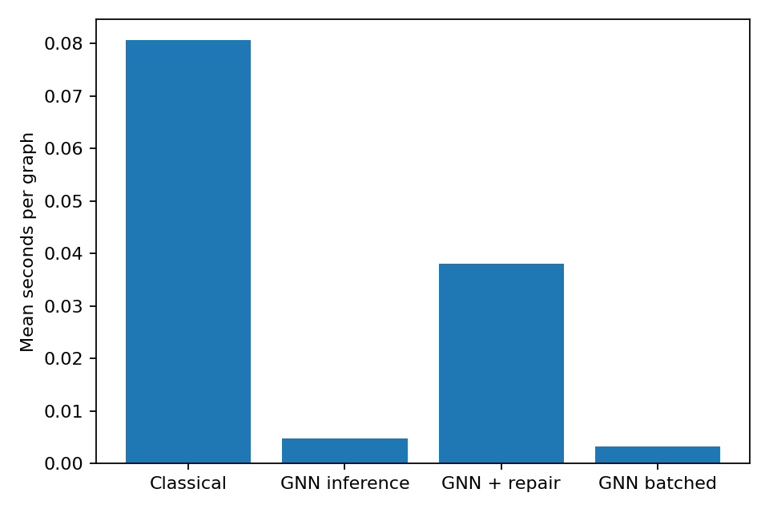

# Phase 9 — Results checklist

## Foundations and experimental protocol

The hand-derived liveness, interference, and Chaitin–Briggs example is in
[Phase 1](phase1_background.md).  Graphs are split before loading or
normalisation: 350 training, 75 validation, and 75 test graphs.  Feature
normalisation is fitted on training nodes only and reused unchanged for every
validation and test run.  All Phase 6 architectures use the same five node
features, data split, one-epoch training budget, batch size 128, optimiser,
and seeds `0`, `1`, and `2`.

## Dataset statistics

| Property | Value |
|---|---:|
| Graphs | 500 |
| Split | 350 / 75 / 75 (train / validation / test) |
| Nodes per graph (min / median / mean / max) | 10 / 112.5 / 109.6 / 200 |
| Node spill rate | 29.85% |
| Register budgets | 4: 167 graphs; 8: 167; 16: 166 |

The samples are synthetic TAC programs with real CFG, liveness, interference,
and allocator processing.  They are not independently sampled random graphs.

## Architecture comparison

The following is mean test spill F1 ± population standard deviation over three
fixed seeds.  GraphSAGE is the selected architecture for the benchmark.

| Architecture | Test F1 (mean ± std) |
|---|---:|
| GCN | 0.4990 ± 0.0301 |
| GraphSAGE | 0.6751 ± 0.0602 |
| GAT (4 heads) | 0.1527 ± 0.2160 |

## Multi-class register assignment (Phase 5)

`GCNRegisterPredictor` is implemented with a shared 17-class output space:
registers `R0`–`R15` and a fixed `SPILL` class.  Per-node masking prevents a
4-register graph from predicting `R4`–`R15`, while still allowing `SPILL`.
`repair_conflicts` resolves raw matching-colour interference edges in
highest-degree-first order.  This multi-class path passed a one-epoch smoke
test, but it is not the model used for the Phase 6/7 numerical comparison;
those results intentionally benchmark the spill-prediction plus greedy-repair
pipeline.

## Feature ablation (GraphSAGE)

| Feature subset | Test F1 (mean ± std) |
|---|---:|
| All features | 0.6751 ± 0.0602 |
| No `loop_depth` | 0.5550 ± 0.0954 |
| No `is_move_related` | 0.6083 ± 0.0746 |
| No `live_range_length` | 0.4868 ± 0.1612 |

For this corpus and budget, `live_range_length` is the strongest of the three
ablated features; removing it has the largest mean F1 drop.  The high
variance, especially without live-range length, is also a warning not to
over-interpret this short training run.

## Classical baseline versus GNN plus repair

The Java benchmark measures the Chaitin–Briggs allocation call with
`System.nanoTime`.  The Python benchmark measures individual GNN inference
with `time.perf_counter`, then separately measures the full inference-plus-
repair pipeline.  Batched GNN time is reported per graph and is not used as a
substitute for single-graph latency.

| Test-set mean over 75 graphs | Value |
|---|---:|
| Classical spills | 33.17 |
| GNN + repair spills | 41.72 |
| Classical valid-colouring rate | 100.0% |
| GNN pre-repair valid-colouring rate | 5.3% |
| GNN post-repair valid-colouring rate | 100.0% |
| Classical allocator time / graph | 80.56 ms |
| GNN inference time / graph | 4.77 ms |
| GNN + repair time / graph | 38.01 ms |
| GNN batched inference time / graph | 3.19 ms |

The repair pass uses GNN spill probabilities and a deterministic greedy colour
assignment.  Its post-repair validity is guaranteed by checking already
assigned neighbours and spilling a node only if no register remains.

## Coalescing (Phase 8)

`CoalesceClassifier` and the frozen-encoder training path are implemented in
`ml_side/models.py` and `ml_side/coalesce.py`.  The dataset now exposes move
edges and their `coalesce_safe` labels.  The head has not yet been separately
trained and evaluated, so coalescing accuracy is future work rather than a
claimed result.

## Full-stack summary

- **Java:** CFG construction, fixed-point liveness, interference/move graph
  construction, conservative Chaitin–Briggs allocation, JSON export, synthetic
  graph generation, and classical timing benchmark.
- **Python:** `torch`, `torch_geometric`, `networkx`, `numpy`, `pandas`,
  `matplotlib`, and `scikit-learn`.
- **PyG:** `Data`, `Dataset`, `DataLoader`, `GCNConv`, `SAGEConv`, and
  `GATConv`.
- **Non-negotiable controls:** graph-level splits, train-only normalisation,
  positive-class weighting, fixed multi-seed comparisons, and repair-aware
  validity measurements.

## Honest limitations

1. The programs are synthetic and do not yet include real compiler IR, calling
   conventions, aliasing, irregular control flow, or real spill-rewrite costs.
2. Graphs are limited to 10–200 nodes.  Memory use, neighbour aggregation, and
   repair behaviour could change materially at production compiler scale.
3. The reported Phase 6 comparison uses three seeds but only a one-epoch smoke
   budget, selected to make the end-to-end experiment runnable on this CPU.
   It establishes the evaluation pipeline, not final convergence-quality model
   numbers.  Re-run `python -m ml_side.evaluate --epochs 30 --batch-size 128`
   for the planned longer-budget comparison.
4. The reported Phase 7 GNN predicts spills only; register colours are supplied
   by a greedy repair heuristic.  A masked multi-class GCN baseline exists but
   has not yet been evaluated under the same multi-seed protocol.  A joint
   colour-and-spill model or learned repair policy would be a stronger learned
   allocator claim.
