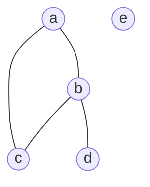

# Phase 1 — Theoretical Background & Worked Example: GNN Register Allocation

This document presents a complete hand-traced worked example of backward data-flow liveness analysis, interference graph construction, and Chaitin-Briggs graph-coloring register allocation. This manual trace serves as the foundational specification for the compiler subsystem and ground-truth label generator.

---

## 1. Input Program (Three-Address Code IR)

Consider the following canonical 3-address code (TAC) snippet:

```text
L01: a = 1
L02: b = 2
L03: c = a + b
L04: d = a * c
L05: e = b + d
L06: return e
```

---

## 2. Backward Data-Flow Liveness Analysis

### Formulations
For each instruction $I$, data-flow liveness equations are evaluated iteratively in reverse topological order:
$$\text{live\_out}[I] = \bigcup_{S \in \text{succ}[I]} \text{live\_in}[S]$$
$$\text{live\_in}[I] = \text{use}[I] \cup (\text{live\_out}[I] - \text{def}[I])$$

### Detailed Instruction-by-Instruction Liveness Table

| Line | Instruction | `def` | `use` | `live_in` | `live_out` | Notes |
| :--- | :--- | :--- | :--- | :--- | :--- | :--- |
| **L06** | `return e` | $\emptyset$ | $\{e\}$ | $\{e\}$ | $\emptyset$ | End of function |
| **L05** | `e = b + d` | $\{e\}$ | $\{b, d\}$ | $\{b, d\}$ | $\{e\}$ | $e$ defined; $b, d$ needed upstream |
| **L04** | `d = a * c` | $\{d\}$ | $\{a, c\}$ | $\{a, b, c\}$ | $\{b, d\}$ | $d$ defined; $b$ propagates from L05 |
| **L03** | `c = a + b` | $\{c\}$ | $\{a, b\}$ | $\{a, b\}$ | $\{a, b, c\}$ | $c$ defined; $a, b$ propagate from L04 |
| **L02** | `b = 2` | $\{b\}$ | $\emptyset$ | $\{a\}$ | $\{a, b\}$ | $b$ defined; $a$ propagates from L03 |
| **L01** | `a = 1` | $\{a\}$ | $\emptyset$ | $\emptyset$ | $\{a\}$ | $a$ defined; start of program |

---

## 3. Interference Graph Construction

### Rule
Two virtual registers $u$ and $v$ interfere (share an interference edge) if $u$ is defined at an instruction where $v$ is live-out ($u \neq v$).

### Interference Edge Derivation
1. At **L01**: `a` defined, `live_out = {a}` $\rightarrow$ no edge.
2. At **L02**: `b` defined, `live_out = {a, b}` $\rightarrow$ Edge **(a, b)**.
3. At **L03**: `c` defined, `live_out = {a, b, c}` $\rightarrow$ Edges **(c, a)**, **(c, b)**.
4. At **L04**: `d` defined, `live_out = {b, d}` $\rightarrow$ Edge **(d, b)**.
5. At **L05**: `e` defined, `live_out = {e}` $\rightarrow$ no edge.
6. At **L06**: No defs $\rightarrow$ no edge.

### Topology Summary
- **Nodes**: $V = \{a, b, c, d, e\}$
- **Interference Edges**: $E_{\text{interf}} = \{(a, b), (a, c), (b, c), (b, d)\}$

### Graph Topology & Node Degrees
- $\text{deg}(a) = 2$ (neighbors: $b, c$)
- $\text{deg}(b) = 3$ (neighbors: $a, c, d$)
- $\text{deg}(c) = 2$ (neighbors: $a, b$)
- $\text{deg}(d) = 1$ (neighbors: $b$)
- $\text{deg}(e) = 0$ (neighbors: none)



---

## 4. Classical Chaitin-Briggs Allocation Trace

Let physical register budget be $K = 2$ registers $\{R_0, R_1\}$.

### Spill Cost Calculation
Formula: $\text{SpillCost}(v) = \frac{\text{uses}(v) + \text{defs}(v)}{\text{deg}(v)}$

- $\text{SpillCost}(a) = \frac{2 + 1}{2} = 1.50$
- $\text{SpillCost}(b) = \frac{2 + 1}{3} = 1.00$  *(lowest cost among degree $\ge K$)*
- $\text{SpillCost}(c) = \frac{1 + 1}{2} = 1.00$
- $\text{SpillCost}(d) = \frac{1 + 1}{1} = 2.00$
- $\text{SpillCost}(e) = \infty$ ($\text{deg} = 0$)

---

### Step-by-Step Allocation Execution ($K = 2$)

#### Phase 1: Simplification & Optimistic Spilling
1. **Remove $e$** ($\text{deg} = 0 < 2$): Push $e$ to stack. Stack = `[e]`. Remaining nodes: $\{a, b, c, d\}$.
2. **Remove $d$** ($\text{deg} = 1 < 2$): Push $d$ to stack. Stack = `[e, d]`. Remaining nodes: $\{a, b, c\}$.
3. Remaining nodes $\{a, b, c\}$ all have degree $2 \ge K=2$. Simplification is stuck!
4. **Optimistic Spill Candidate Selection**: Pick node with lowest spill cost $\text{SpillCost}(b) = 1.00$.
5. **Remove $b$ (Potential Spill)**: Push $b$ to stack. Stack = `[e, d, b]`. Remaining nodes: $\{a, c\}$.
6. **Remove $a$** ($\text{deg} = 0 < 2$): Push $a$ to stack. Stack = `[e, d, b, a]`.
7. **Remove $c$** ($\text{deg} = 0 < 2$): Push $c$ to stack. Stack = `[e, d, b, a, c]`.

#### Phase 2: Select & Color Assignment
Pop elements from stack one by one and assign non-conflicting physical registers from $\{R_0, R_1\}$:

1. **Pop $c$**: Neighbors in graph = $\emptyset$. Assign **$R_0$**.
2. **Pop $a$**: Neighbors = $\{c \mapsto R_0\}$. Assign **$R_1$**.
3. **Pop $b$**: Neighbors = $\{a \mapsto R_1, c \mapsto R_0, d \mapsto \text{unassigned}\}$. Both $R_0$ and $R_1$ are taken! Cannot color $b$. Mark $b$ as **`SPILL`**.
4. **Pop $d$**: Neighbors = $\{b \mapsto \text{SPILL}\}$. Available colors = $\{R_0, R_1\}$. Assign **$R_0$**.
5. **Pop $e$**: Neighbors = $\emptyset$. Assign **$R_0$**.

---

## 5. Final Register Allocation Summary ($K=2$)

| Variable | Degree | Spill Cost | Physical Register / Status |
| :--- | :--- | :--- | :--- |
| **a** | 2 | 1.50 | **$R_1$** |
| **b** | 3 | 1.00 | **`SPILL` (Stack Slot 0)** |
| **c** | 2 | 1.00 | **$R_0$** |
| **d** | 1 | 2.00 | **$R_0$** |
| **e** | 0 | $\infty$ | **$R_0$** |

### Execution Outcome:
- Total Spills: **1** (`b`)
- Physical Registers Used: **2 / 2** ($R_0, R_1$)
- Coloring Conflicts: **0** (Valid allocation)
